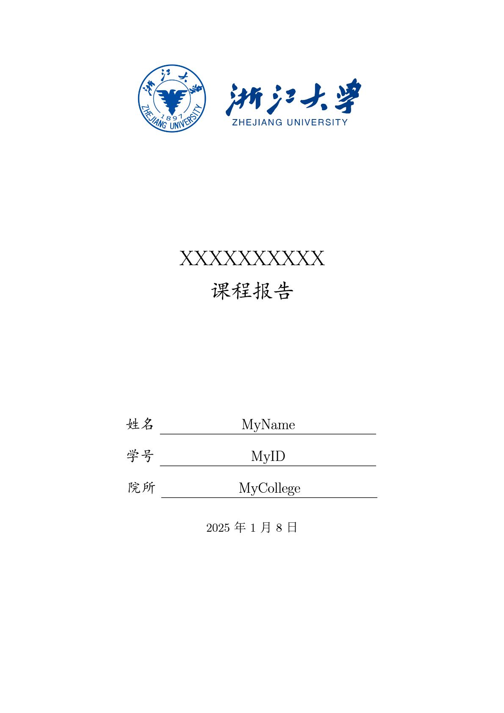
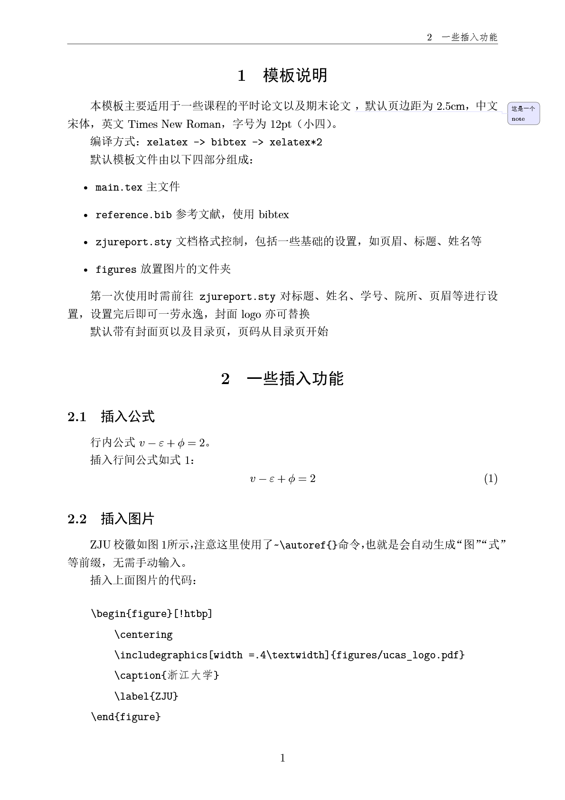
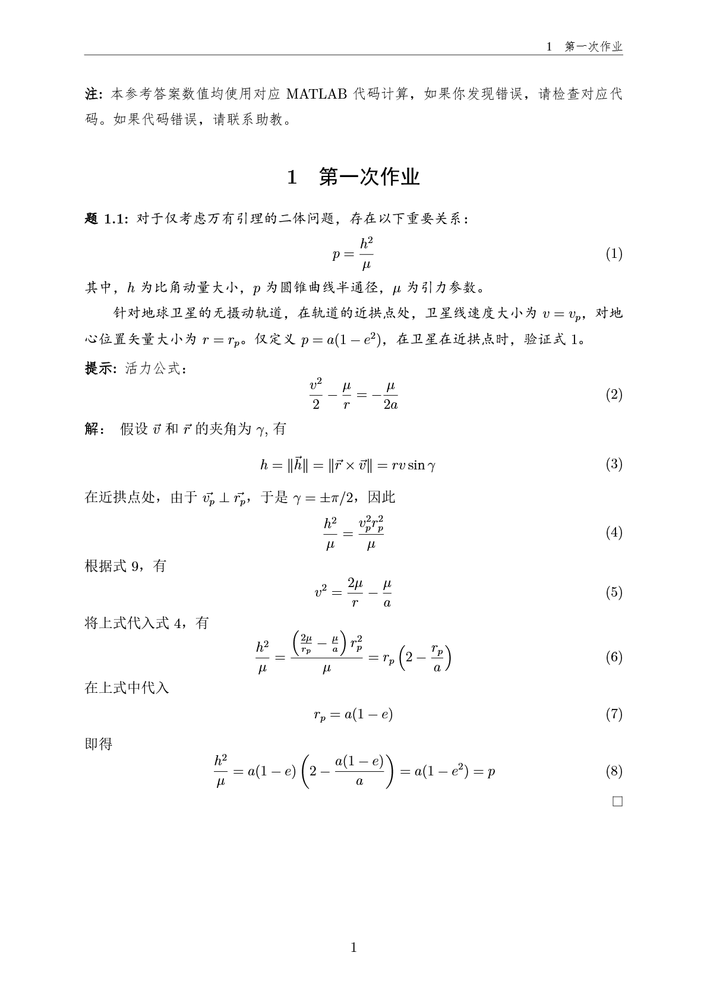
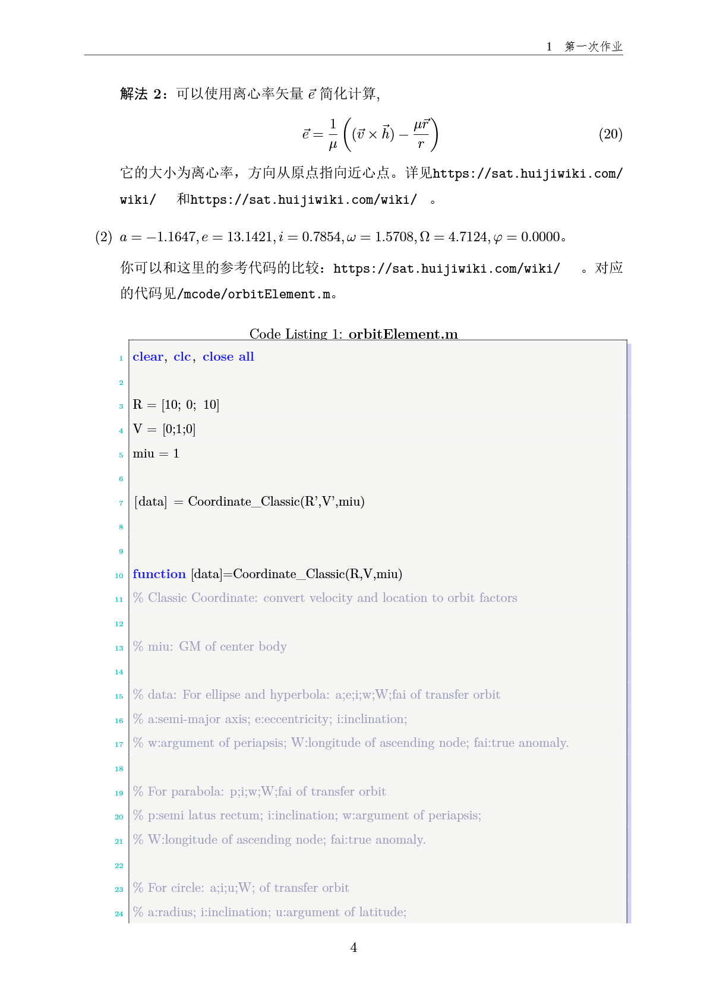

## MyZJUreportTemplate

> See also:    
> [ZJUreport](https://github.com/haochengxia/zjureport)   
> [UCAS_Latex_Template](https://github.com/jweihe/UCAS_Latex_Template)

### Intro
A simple $\LaTeX$ templete for reports of ZJU, developed from [ZJUreport](https://github.com/haochengxia/zjureport) with some minor changes:
+ Use `GB/T-7714` standard for citation with the [gbt7714](https://ctan.org/pkg/gbt7714) package 
+ Use `enumitem` package instead of `enumerate` for better flexibility
+ Use `subfig` package instead of `subfigure` package, since the latter is a relatively old package
+ Use `AutoFakeBold` and `AutoFakeSlant` for better bold and italic font support
+ Fix page numbering to start form the main body
+ Add a note method with `todonotes` package, add a note with
    ```LATEX
    \reportnote[<color>]{<text>} % or
    \reportnote{<text>}
    ```
    the definition of this note is in the [style file](./zjureport.sty) `note definition`.
+ Minor changes according to *my* aesthetic taste 

### Branches
This repo currently provides the following branches
+ **main**: the report template with the revisions above

|  [cover](./figures/example1.png) |  [text](./figures/example2.png)| 
|:---:|:---:|
|  | | 

+ **exercise**: a template for exercise or assignments with the following features:
   + `hint`, `exe`, `solution`, `remark` environment definitions
   + bool variable to control whether to show the answer (at `\setbool{solution}{<true>}`)
   + citing MATLAB code (need further development)
   + an exercise example

|  [exercise](./figures/example3.png) |  [code](./figures/example4.png)| 
|:---:|:---:|
|  | | 

### Using this template
+ just follow the instructions of [UCAS_Latex_Template](https://github.com/jweihe/UCAS_Latex_Template), use the recipe `xelatex->bibtex->xelatex` for compiling the [tex file](./main.tex). If you have no citations, use the recipe `xelatex->xelatex`.
+ if you are using this template with `VSCode` + `LaTeX workshop plugin`, refer to [latexWorkshopSettings.json](./latexWorkshopSettings.json) for the plugin settings 
